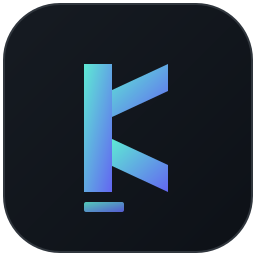

# Khan Programming Language

<p align="center">
  
</p>


Khan is a custom indentation-based programming language built from scratch in C. It includes a lexer, parser, bytecode compiler, virtual machine, native libraries, and package manager. The goal of the project is to provide a practical learning platform for compiler design, runtime architecture, and package-based language ecosystems.

This project is still in active development and is best described as a real, working pre-1.0 language runtime rather than a finished production language. It is intentionally honest about its current maturity and continues to evolve with real compiler and runtime features.

> Repository: [github.com/khandev1211-cpu/Khan](https://github.com/khandev1211-cpu/Khan)

---

## Why Khan?

Khan blends Python-like indentation with a lightweight native runtime and a real bytecode VM. It is designed to explore how programming languages work under the hood while still being usable for practical scripting tasks.

Key goals:

- Understand compiler and VM internals from the ground up
- Build a clean, readable scripting language
- Support native extension modules and package management
- Provide practical tooling for web, file, JSON, OCR, vision, and networking use cases
- Keep the implementation transparent and extensible

---

## Features

- Indentation-based syntax
- Native bytecode compiler and VM
- Built-in functions and standard library
- `kh` package manager
- JSON, HTTP, datetime, filesystem, and SQLite support
- Web framework support via `webi`
- Computer vision and OCR packages
- Package import system
- Cross-platform build support

---

## Quick Start

### Install

Linux / macOS:

```bash
curl -fsSL https://raw.githubusercontent.com/khandev1211-cpu/Khan/main/install.sh | bash
```

Windows (PowerShell):

```powershell
irm https://raw.githubusercontent.com/khandev1211-cpu/Khan/main/install.ps1 | iex
```

### Verify installation

```bash
khan --version
```

### Run a script

```bash
khan hello.kh
```

### Use the REPL

```bash
khan
```

Example:

```khan
let x = 10
x * 5

fn square(n):
    return n * n

square(7)
```

---

## Package Manager

Khan includes a package manager named `kh`.

Common commands:

```bash
kh install math
kh install webi
kh install requests
kh install colors
kh list
kh installed
kh info webi
```

Example:

```khan
import "math"
import "colors"

print green("Khan is ready!")
print math_sqrt(144)
```

---

## Example Programs

### Hello world

```khan
print "Hello, Khan!"
```

### Math example

```khan
import "math"

print PI
print math_sqrt(144)
print math_factorial(6)
```

### Web example

```khan
import "webi"

let app = webi_app()
app = route(app, "GET", "/", fn(req):
    return res_html("<h1>Hello from Khan!</h1>")
)

webi_run(app, 8080)
```

---

## Package Ecosystem

Khan includes a growing package ecosystem covering practical use cases.

### Core packages

- `math`
- `strings`
- `collections`
- `colors`
- `argparse`
- `validation`
- `dotenv`
- `uuid`
- `events`
- `logger`
- `datetime`

### Web and APIs

- `webi`
- `webi_auth`
- `webi_socket`
- `requests`
- `postman`
- `swagger`
- `openai`

### Data and storage

- `fs`
- `csv_io`
- `json_db`
- `orm`
- `sqlite`

### Vision and OCR

- `vision`
- `ocr`

### AI and networking

- `tensor`
- `kbrain`
- `nlp`
- `dns`
- `ftp`
- `grpc`
- `mqtt`
- `smtp`
- `ssh_client`

---

## Building from Source

Requirements:

- GCC or Clang
- GNU Make
- SQLite development headers for SQLite integration
- Optional Tesseract dependencies for OCR support

Build:

```bash
git clone https://github.com/khandev1211-cpu/Khan.git
cd Khan
make
```

Install:

```bash
make install
```

On Linux/macOS, the default install location is `~/.khan/bin`. On Windows, use the PowerShell installer or build manually and add the binary directory to your PATH.

---

## Project Structure

```text
Khan/
├── README.md
├── makefile
├── install.sh
├── install.ps1
├── src/
├── packages/
├── examples/
├── docs/
├── benchmarks/
├── tests/
├── assets/
├── LICENSE
└── ROADMAP_STATUS_UPDATED.md
```

---

## Language Example

```khan
let name = "Irfan"
let age = 25

fn greet(person):
    if age >= 18:
        print "Hello, " + person
    else:
        print "Hello, young friend!"

for n in [1, 2, 3, 4, 5]:
    if n % 2 == 0:
        continue
    print n

greet(name)
```

---

## Roadmap Status

Khan is currently in active development and is best classified as a pre-1.0 language runtime. The core compiler, VM, package manager, and core native modules are already in place, but the project is still evolving in terms of runtime maturity, performance tuning, and feature completeness.

Current focus areas include:

- runtime hardening
- stability and package reliability
- performance improvements
- documentation and usability
- long-term language feature completion

---

## Contributing

Contributions are welcome.

1. Fork the repository
2. Create a feature branch
3. Make your changes
4. Run the project checks locally
5. Open a pull request

Example:

```bash
git checkout -b feature/my-change
make
```

---

## License

This project is licensed under the MIT License. See [LICENSE](LICENSE) for details.

---

## Author

Created and maintained by Irfan Khan.

- GitHub: [@khandev1211-cpu](https://github.com/khandev1211-cpu)
- Repository: [github.com/khandev1211-cpu/Khan](https://github.com/khandev1211-cpu/Khan)

---

Built from scratch in C to explore how real language runtimes are designed and implemented.
